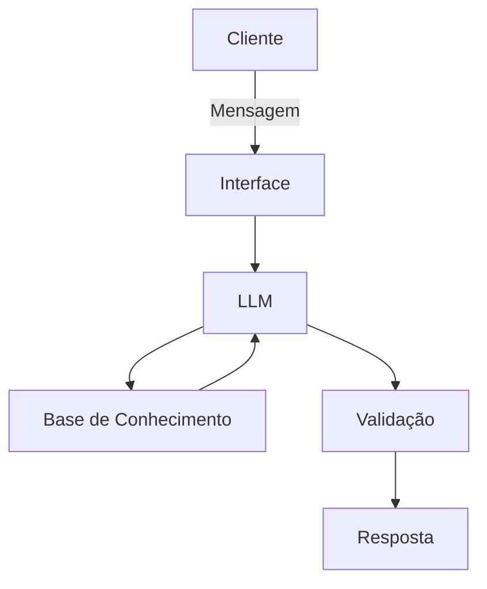

# Documentação do Agente

## Caso de Uso

### Problema
> Qual problema financeiro seu agente resolve?

Muitas pessoas têm dificuldade em controlar seus gastos mensais e acabam perdendo a noção de quanto estão gastando em cada categoria, como alimentação, transporte ou lazer.

### Solução
> Como o agente resolve esse problema de forma proativa?

O agente financeiro permite que o usuário informe seus gastos do dia a dia em linguagem natural. O sistema analisa essas informações, organiza os gastos por categoria e apresenta um resumo simples com o total gasto e sugestões de controle financeiro.

### Público-Alvo
> Quem vai usar esse agente?

Pessoas que desejam ter maior controle sobre suas finanças pessoais, especialmente estudantes e jovens profissionais que estão começando a organizar seu orçamento.

---

## Persona e Tom de Voz

### Nome do Agente
FinBot

### Personalidade
> Como o agente se comporta? (ex: consultivo, direto, educativo)

Consultivo e educativo, ajudando o usuário a entender melhor seus hábitos financeiros.

### Tom de Comunicação
> Formal, informal, técnico, acessível?

Acessível e simples, utilizando linguagem clara para facilitar o entendimento de pessoas sem conhecimento financeiro avançado.

### Exemplos de Linguagem
- Saudação: Olá! Vamos organizar seus gastos hoje?
- Confirmação: Entendi! Vou organizar esses valores para você.
- Erro/Limitação: Não consegui identificar todos os valores informados. Poderia reformular a informação?

---

## Arquitetura

### Diagrama

### Componentes

| Componente | Descrição |
|------------|-----------|
| Interface | Chatbot em Streamlit |
| LLM | GPT-4 via API |
| Base de Conhecimento | JSON/CSV com dados do cliente |
| Validação | Checagem de alucinações |

---

## Segurança e Anti-Alucinação

### Estratégias Adotadas

- [ ] O agente utiliza apenas informações fornecidas pelo usuário.
- [ ] Não realiza recomendações de investimentos.
- [ ] Organiza apenas os dados financeiros informados.

### Limitações Declaradas
> O que o agente NÃO faz?

- [ ] O agente não acessa contas bancárias.
- [ ] Não realiza cálculos financeiros complexos.
- [ ] Não substitui orientação de um profissional financeiro.
